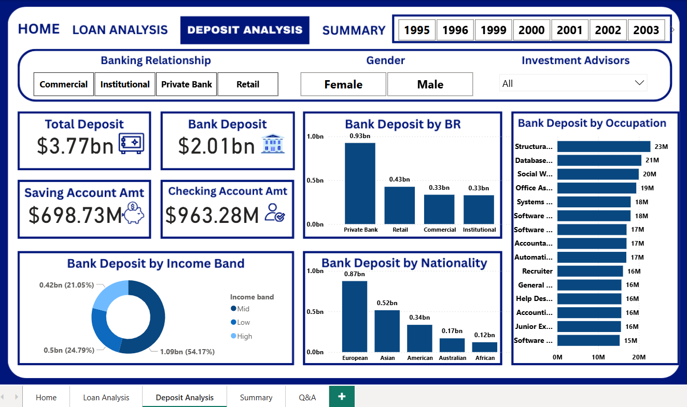

# Bank Analytics Dashboard 🏦📊

A comprehensive banking analytics dashboard providing detailed insights into customer behavior, loan analysis, and deposit patterns. This interactive dashboard enables financial institutions to make data-driven decisions through advanced customer segmentation and performance metrics.

## 📈 Features

### 🎯 Core Analytics
- **Customer Segmentation**: Advanced analysis of 3,000+ customers
- **Loan Analysis**: Comprehensive lending insights worth $4.38bn
- **Deposit Analysis**: Detailed deposit tracking totaling $3.77bn
- **Business Intelligence**: Real-time metrics and KPIs

### 🔍 Key Metrics Tracked
- Total Clients: 3,000
- Total Loans: $4.38 billion
- Total Deposits: $3.77 billion
- Business Lending: $2.60 billion
- Bank Deposits: $2.01 billion
- Checking Accounts: $963.28 million
- Savings Accounts: $698.73 million

### 📊 Dashboard Sections

#### 1. Home Dashboard
- Overview of key metrics
- KPI cards for quick insights
- Navigation to detailed analysis sections
- Quick access to loan and deposit analysis
- Filtering options for dynamic data exploration 

#### 2. Loan Analysis
- Detailed loan portfolio breakdown
- Loan distribution by banking relationship type
- Income band analysis
- Nationality-based loan patterns
- Occupation-wise lending insights

#### 3. Deposit Analysis
- Comprehensive deposit tracking
- Deposit segmentation by customer demographics
- Banking relationship analysis
- Income and occupation-based deposit patterns

#### 4. Summary Dashboard
- Overview of all key banking metrics
- High-level KPIs and performance indicators
- Quick access to detailed analysis sections

## 🖼️ Dashboard Previews

### Home Dashboard

*Main navigation and overview interface*

### Loan Analysis Dashboard

*Detailed loan portfolio analysis and customer segmentation*

### Deposit Analysis Dashboard

*Comprehensive deposit tracking and customer insights*

### Summary Dashboard

*Overview of key banking metrics and KPIs*

## 🎨 Dashboard Features

### 📋 Filtering Options
- **Banking Relationship**: Commercial, Institutional, Private Bank, Retail
- **Gender**: Female, Male, All
- **Time Period**: 1995-2003 historical data analysis
- **Investment Advisors**: Comprehensive advisor tracking

### 📊 Visualization Types
- **KPI Cards**: Key performance indicators
- **Bar Charts**: Comparative analysis across categories
- **Pie Charts**: Distribution and proportion analysis
- **Horizontal Bar Charts**: Occupation and demographic breakdowns

### 🎯 Customer Segmentation
- **By Income Band**: High, Mid, Low income categories
- **By Nationality**: European, Asian, American, Australian, African
- **By Occupation**: 15+ occupation categories tracked
- **By Banking Relationship**: 4 distinct relationship types

## 📊 Key Insights

### Loan Portfolio Highlights
- **Private Bank** clients represent the highest loan volume
- **Mid-income** segment dominates lending (53.12%)
- **European** customers lead in loan uptake
- **Account Management** professionals are top borrowers

### Deposit Portfolio Highlights
- **Private Bank** relationships hold the largest deposits
- **Mid-income** customers form the largest deposit base (54.17%)
- **European** customers show highest deposit engagement
- **Structural Engineering** professionals lead in deposits

## 🛠️ Technical Implementation

### Dashboard Capabilities
- Interactive filtering and drill-down functionality
- Real-time data updates and refresh capabilities
- Cross-platform compatibility
- Responsive design for various screen sizes

### Data Processing
- Advanced customer segmentation algorithms
- Statistical analysis and trend identification
- Automated KPI calculations
- Data validation and quality checks

## 🚀 Getting Started

1. Clone the repository
2. Navigate to the project directory
3. Follow the setup instructions in the documentation
4. Launch the dashboard application

## 📊 Use Cases

### For Bank Executives
- Strategic decision making based on customer insights
- Portfolio performance monitoring
- Risk assessment and management

### For Relationship Managers
- Customer segmentation for targeted campaigns
- Cross-selling opportunities identification
- Client relationship optimization

### For Risk Management
- Loan portfolio risk assessment
- Customer credit analysis
- Deposit stability tracking

## 🎯 Business Value

- **Enhanced Customer Understanding**: Deep insights into customer behavior patterns
- **Improved Decision Making**: Data-driven strategic decisions
- **Risk Mitigation**: Better understanding of portfolio composition
- **Revenue Optimization**: Identification of high-value customer segments
- **Operational Efficiency**: Streamlined reporting and analysis processes

## 📈 Future Enhancements

- [ ] Predictive analytics integration
- [ ] Real-time data streaming
- [ ] Advanced machine learning models
- [ ] Mobile application development
- [ ] API integration capabilities

## 🤝 Contributing

Contributions are welcome! Please feel free to submit a Pull Request.

## 📄 License

This project is licensed under the MIT License - see the LICENSE file for details.

## 📞 Contact

For questions or collaboration opportunities, please reach out through GitHub issues.

---

*This dashboard represents a comprehensive solution for banking analytics, providing actionable insights for financial institutions to optimize their operations and customer relationships.*